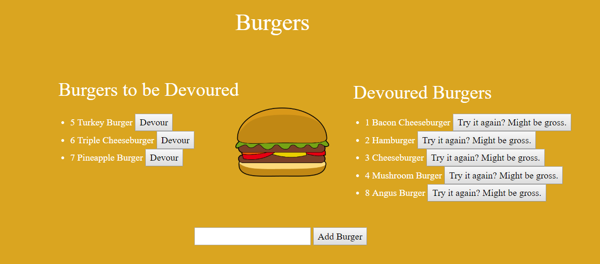

# Burger

## Technologies Used:

- JavaScript
- jQuery
- handlebars.js
- node.js
- mySQL

## Functionality 

Using a self-made ORM there were 3 CRUD functions used:

1. READ - to review everything within the database and all the different burger types users inputted, devoured, etc.

2. CREATE - was used to add new burgers to the list that users could then "devour"

3. UPDATE - Users could UPDATE when they hit the devour button causing the burger to be "eaten"

## Screenshot

